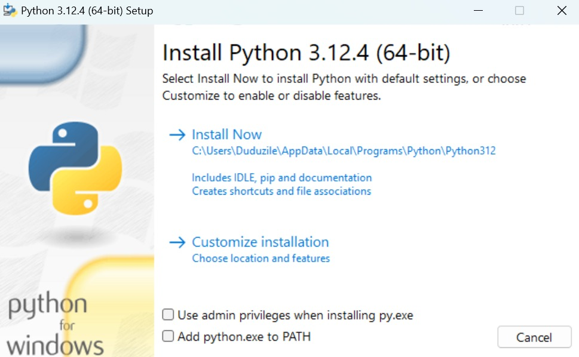
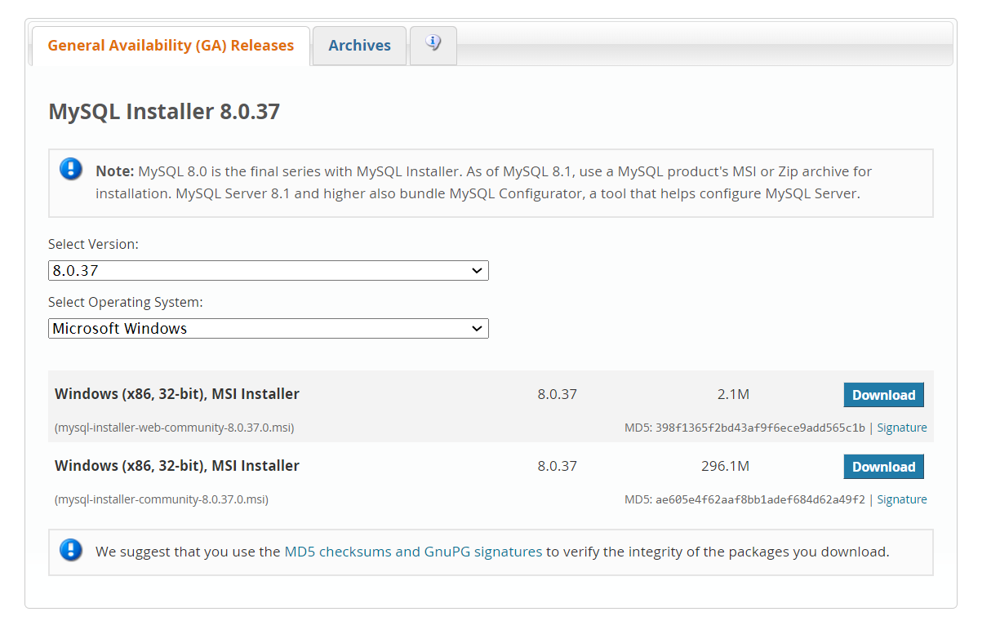

# Dev_Setup
Setup Development Environment

#Assignment: Setting Up Your Developer Environment

#Objective:
This assignment aims to familiarize you with the tools and configurations necessary to set up an efficient developer environment for software engineering projects. Completing this assignment will give you the skills required to set up a robust and productive workspace conducive to coding, debugging, version control, and collaboration.

#Tasks:

1. Select Your Operating System (OS):
   Choose an operating system that best suits your preferences and project requirements. Download and Install Windows 11. https://www.microsoft.com/software-download/windows11

Step by step instructions on how to install windows 11:
Requirements:
-An internet connection
-A blank USB drive with at least 8GB of storage (ensure the USB is blank).

Step 1- Plug the USB drive into desktop..

Step 2 -  https://www.microsoft.com/software-download/windows11, press the below button to Download the media creation tool

Step 3 - After the download is completed, open the media creation tool file to run it (Accept license terms)

Step 4 - Select the bootable USB flash drive with at least 8GB of space that you have prepared to use, then select Next. The USB device will be formatted, and the Windows installation media will be placed on the USB flash drive.

Step 5 - Restart your PC while holding the Shift key to boot into the Windows Recovery Environment. Once open choose to boot from the USB drive.

Step 6 - On the Windows Setup page, select your language and time then select Next. Select Install now.

2. Install a Text Editor or Integrated Development Environment (IDE):
   Select and install a text editor or IDE suitable for your programming languages and workflow. Download and Install Visual Studio Code. https://code.visualstudio.com/Download

Step by step instructions on how to install Visual Studio Code:

Step 1: Visit https://code.visualstudio.com/DownloadOfficial using a web browser .

Step 2: Press the “Download for Windows” button to download the application.

Step 3: Click on the Install icon to start the installation process of the app.

Step 4: After the Installer opens, accept the terms and conditions of the Visual Studio Code then click the Next button.

Step 5: Choose the location data for running the Visual Studio Code. It will then ask you to browse the location.

Step 6: Click on the Install button.

Step 7: After clicking on Install, it will take about 1 minute to install the Visual Studio Code on your device.

Step 8: Tick the “Launch Visual Studio Code” checkbox and then click Next.

Step 9: The Visual Studio Code window opens successfully. Now you can create a new file in the app

3. Set Up Version Control System:
   Install Git and configure it on your local machine. Create a GitHub account for hosting your repositories. Initialize a Git repository for your project and make your first commit. https://github.com

4. Install Necessary Programming Languages and Runtimes:
  Instal Python from http://wwww.python.org programming language required for your project and install their respective compilers, interpreters, or runtimes. Ensure you have the necessary tools to build and execute your code.

Step by step instructions on how to install Python:
Step 1 - Visit http://wwww.python.org on the browser

Step 2- Select Version to Install Python

Step 3- Download the Python Installer to desktop

Step 4- Click on the 'Install Now' Button the setup will start installing Python on your Windows system.

Step 5 - Python will be installed on your Windows system. You will see a successful message.

5. Install Package Managers:
   If applicable, install package managers like pip (Python).

Step by step instructions on how to install pip:
Step 1: Download PIP get-pip.py. Before installing PIP, download the get-pip.py file. 

Step 2: To install PIP, run the following Python command: python get-pip.py.

Step 3: Verify Installation.

Step 4: Add Pip to Path. 

Step 5: Configuration.

6. Configure a Database (MySQL):
   Download and install MySQL database. https://dev.mysql.com/downloads/windows/installer/5.7.html

Step by step instructions on how to install MySQL:
Step 1 - Download the MySql installer on https://dev.mysql.com/downloads/installer/

Step 2 - Set up MySQL installer 

Step 3 Configure MySQL server

Step 4 - Complete MySQL installation

Step 5 - Start the MySQL server on windows

7. Set Up Development Environments and Virtualization (Optional):
   Consider using virtualization tools like Docker or virtual machines to isolate project dependencies and ensure consistent environments across different machines.

8. Explore Extensions and Plugins:
   Explore available extensions, plugins, and add-ons for your chosen text editor or IDE to enhance functionality, such as syntax highlighting, linting, code formatting, and version control integration.

9. Document Your Setup:
    Create a comprehensive document outlining the steps you've taken to set up your developer environment. Include any configurations, customizations, or troubleshooting steps encountered during the process. 

#Deliverables:
- Document detailing the setup process with step-by-step instructions and screenshots where necessary.
- A GitHub repository containing a sample project initialized with Git and any necessary configuration files (e.g., .gitignore).
- A reflection on the challenges faced during setup and strategies employed to overcome them.

#Submission:
Submit your document and GitHub repository link through the designated platform or email to the instructor by the specified deadline.

#Evaluation Criteria:**
- Completeness and accuracy of setup documentation.
- Effectiveness of version control implementation.
- Appropriateness of tools selected for the project requirements.
- Clarity of reflection on challenges and solutions encountered.
- Adherence to submission guidelines and deadlines.

Note: Feel free to reach out for clarification or assistance with any aspect of the assignment.
